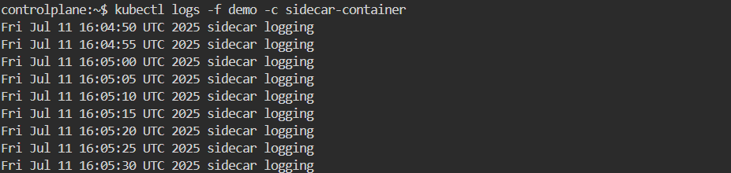

# NFS Volume Mount with Sidecar Logging

## Objective

Configure an NFS server and mount a shared volume in a Kubernetes pod using two containers:
- A main container (`nginx`) that serves content from the NFS mount.
- A sidecar container (`busybox`) that logs data into the same volume.

---

## Steps and Commands

### 1. Update the package index
```bash
sudo apt update
```
### 2. Install NFS server dependencies
```bash
sudo apt install nfs-kernel-server -y
```
### 3. Create shared directory and set permissions
```bash
sudo mkdir -p /mnt/shared
sudo chown nobody:nogroup /mnt/shared
sudo chmod 777 /mnt/shared

```
### 4. Configure NFS export
```bash
sudo nano /etc/exports
```
#### Add:
```bash
/mnt/shared *(rw,sync,no_subtree_check,no_root_squash,insecure)
```
### 5. Apply the export config and start the server
```bash
sudo exportfs -a
sudo systemctl restart nfs-kernel-server
sudo systemctl enable nfs-kernel-server
```
### 6. Create the Pod YAML definition 
- [pod.yml](./pod.yml)

### 7. Apply the Pod
```bash
kubectl apply -f pod.yml
```
### 8.  Verify the Pod is Running
```bash
kubectl get pods
```
### 9. Test NFS Mount
```bash
kubectl exec -it demo -c main -- sh
cd /mnt/nfs
touch myfile.txt
```
#### Check on host:
```bash
ls -l /mnt/shared
```
### 10. Check Sidecar Logs
```bash
kubectl logs -f demo -c sidecar-container
```
# Outcome:

